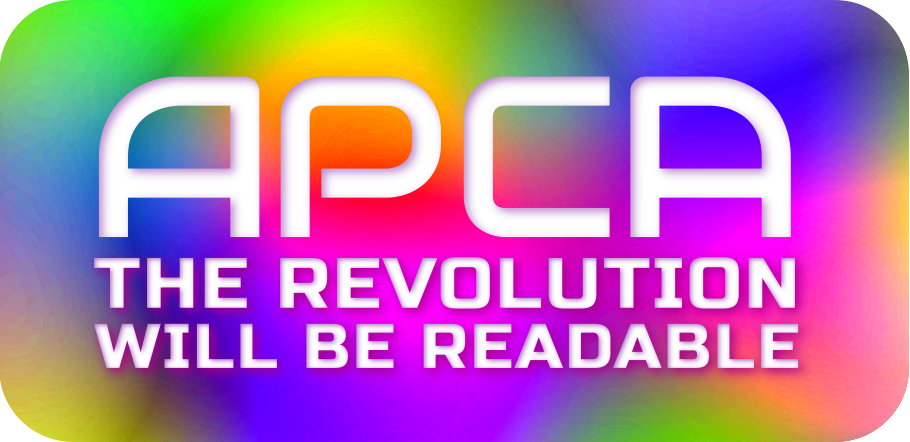

# Myndex Color & Contrast Resources
**QuickStart:** In an effort to pare down this mountain of material, here's a [link-tree](https://linktr.ee/Myndex) of the key links, with the most basic at the top: [_**linktr.ee/Myndex**_](https://linktr.ee/Myndex)

## Featured Articles
### _On Readability & Contrast_

- [The Realities And Myths Of Contrast And Color](https://www.smashingmagazine.com/2022/09/realities-myths-contrast-color/) An in-depth primer to vision, color, and contrast for design, with an emphasis on typography and reqadability needs. Pubished in Smashing Magazine.
- [**Better reading on the web**](https://uxdesign.cc/better-reading-on-the-web-c943c4cfc91a) Published by _UX Collective_ (uxdesign.cc). This article discusses and demonstrates the problems with automated testing and WCAG 2 contrast math, methods, and guidelines.
- Published at _Tangled Web_ (TangledWeb.xyz):
    - [Busy Background Breaks Bulletin](https://tangledweb.xyz/busy-background-breaks-bulletin-f4ff4bf67e5a) Examples of how to destroy readability by choosing the wrong image as a background. And also, how to fix it.
    - [**Please Stop Using Grey Text**](https://tangledweb.xyz/please-stop-using-grey-text-3d3e71acfca8) Debunking one of the worst myths regarding design contrast. THis article went viral in early 2022.
    - [**What's Red & Black & Also Not Read?** ](https://tangledweb.xyz/whats-red-black-also-not-read-573b9c0a97ed) Do the WCAG 2 Contrast Guidelines help users with color vision issues? While this is a widely held belief, the truth may surprise you. 
    - [**A Contrast of Errors**](https://tangledweb.xyz/a-contrast-of-errors-373c2665d42a) A look into the history of the WCAG 2 contrast guidelines and some of the problems created by them, and a discussion of the proposed replacement, the APCA (Accessible Perceptual Contrast Algorithm).

### _Additional Color & Contrast Related Articles_
- [**Basics of Luminance Contrast**](https://www.myndex.com/WEB/LuminanceContrast) A precursor to the Contrast FAQ.
- [**Creating Color Gradients, Part I**](https://www.myndex.com/WEB/Gradients) Experiments and discussion of color spaces for gradient creation.
- [**Color Gradients, Part II**](https://www.myndex.com/WEB/GradientsPartTwo) More experiments and more color spaces.
- [**PDF on Accessible Fonts**](https://www.myndex.com/PUB/PDF/AccessibleFontsD.pdf) A PDF that discusses key factors in fonts for readability.
- [**Contrasting Theories**](https://tangledweb.xyz/hi-roger-f51bde490a56) Article at _Tangled Web_
- [**A Contast of Contrasts**](https://tangledweb.xyz/a-contrast-of-contrasts-3ddda0f4061b) Article at _Tangled Web_

### _General IT & Web_
- [**Modern Password Theory in a Nutshell** ](https://tangledweb.xyz/modern-password-theory-in-a-nutshell-da87db012c08) Would it surprise you to know that fistsmash passwords aren't really more secure than one you can actually remember? You could say this is 0u+_W!+h_+h3_01d-InWithTheNew! — In other words, "Out With The Old - In With The New." It's a realistic discussion on password security, with a useful approach to reducing "crackability". _HINT: we've all been doing it wrong, LOL._ Article at _TangledWeb.xyz_ 
- [**Improving SEO with Redirects**](https://www.myndex.com/WEB/RedirectsForSEO) Your server's case sensitivity and URL redirect strategies can affect your search ranking!

----- 
# Accurate Contrast Using the APCA
## The Accessible Perceptual Contrast Algorithm
- [**Why APCA?** ](https://git.apcacontrast.com/documentation/WhyAPCA) A brief introduction to WCAG_2 contrast problems and how APCA solves them.  
- [**APCA in a Nutshell** ](https://git.apcacontrast.com/documentation/APCA_in_a_Nutshell) Simple overview for using APCA.
- [**APCA FAQ**](https://git.apcacontrast.com/documentation/APCA_FAQ)

### _APCA DOCUMENTATION_
- [**Main Readme Doc** (HTML version)](https://git.apcacontrast.com/documentation/README) Includes the math and walkthroughs, and additional resources.

### _Sciencey Stuff!_
Maths! Vision Science! Photons on Parade!
- [The base APCA-W3 formula](https://github.com/Myndex/SAPC-APCA/blob/master/documentation/APCA-W3-LaTeX.md) in LaTeX math for your viewing and calculating pleasure.
- [Regarding Exponents](https://git.apcacontrast.com/documentation/regardingexponents) Some notes and explaination regarding the powercurve exponents.
- [Standard Observer Model](https://git.apcacontrast.com/documentation/StandardObserverModel) Draft standardized envirnment.
- [Visual Contrast Draft Whitepaper](https://www.w3.org/WAI/GL/task-forces/silver/wiki/Visual_Contrast_of_Text_Subgroup/Whitepaper) (Work in progress)

### _For Developers_
- [RepoList](https://git.apcacontrast.com/documentation/repoList)
- [Important Change Notices](https://git.apcacontrast.com/documentation/ImportantChangeNotices)
- [How to Contribute](https://git.apcacontrast.com/documentation/CONTRIBUTING)

### _Related Repositories_
- [**_APCA W3 Repository_**](https://github.com/Myndex/apca-w3) The W3 version for web content
- [**_Bridge PCA Repository_**](https://github.com/Myndex/bridge-pca) Bridge&nbsp;PCA - the WCAG&nbsp;2 compatible version
- [**_Color Parsley Repository_**](https://github.com/Myndex/colorparsley) Fast and easy color string parsing — a NodeJS dependency for many of the SAPC libraries.

### _APCA Discussion Forum Threads_
- [**APCA Use Cases**, Conformance, Research, and Glossary ](https://github.com/Myndex/SAPC-APCA/discussions/39#discussion-3757102) Discussion of use cases for text and non-text elements, and references to the relevant research. Conformance considerations and rational basis for guidelines.
- [**Links To Tools** and Toolmakers ](https://github.com/Myndex/SAPC-APCA/discussions/51#discussion-3776260) Some of the tools that have adopted APCA.
- [**WCAG 2 vs APCA Comparisons** ](https://github.com/Myndex/SAPC-APCA/discussions/30#discussion-3678164) Direct head to head comparisons.
- [**Using APCA with other fonts** ](https://github.com/Myndex/SAPC-APCA/discussions/28#discussioncomment-1610289) Draft method for font weight conformance.

## APCA Peer Review & Third Party Discussion
### _Peer reviews of APCA and third party  comparisons of APCA vs WCAG&nbsp;2_
There are several independent researchers evaluating APCA, and additional third party comparitive reviews that include demonstrations of the functional superiority to existing methods. The first two listed below are technical reviews by peers evaluating the APCA math and methods, and in comparison to WCAG 2 contrast methods and guidelines. APCA is open for peer review and discussion—please contact us if interested in performing an evaluation.
- [Does the contrast ratio actually predict the legibility of website text? ](https://www.cedc.tools/article.html) A comparison of WCAG 2 math and APCA, by Sam Waller, a PhD at the Engineering Design Centre, University of Cambridge, UK.
- [Color Contrast Is Not As Black And White As It Seems ](https://medium.com/@think_ui/why-color-contrast-is-not-as-black-and-white-as-it-seems-94197a72b005) by Roger Attrill, a technical analysis of some of the problems with WCAG 2 contrast math, and comparing and analysing APCA.
- [It’s Time For A More Sophisticated Color Contrast Check ](https://blog.datawrapper.de/color-contrast-check-data-vis-wcag-apca/) A review of APCA and comparison to WCAG 2 contrast, in the use case of dataviz, by Lisa Charlotte Muth.
- [Accessible Palette: stop using HSL for color systems ](https://wildbit.com/blog/accessible-palette-stop-using-hsl-for-color-systems) by Eugene Fedorenko, this is mostly a discussion of his new color pallette tool, but APCA figures into that, and he discusses the integration into the tool vs WCAG&nbsp;2 contrast.
- [Adv. Perceptual Contrast Algorithm](https://typefully.com/u/DanHollick/t/sle13GMW2Brp) Don Hollick's review and discussion of APCA vs WCAG 2.
- [Improving accessibility with the new APCA ](https://www.lightflows.co.uk/blog/improving-accessibility-with-apca/) A review of APCA by Nik Bailey.

### Recognizing issues with WCAG 2 Contrast:  _Discussion with links to third party articles_ 
The problems of 4.5:1 as a target for a guideline not only impact those with impairments, but impact standard vision as well. WCAG&nbsp;2 contrast SCs affect 100% of sighted users. The inherent problems with the WCAG&nbsp;2 contrast math have been known for some time and [widely critisized](https://macwright.com/2019/03/30/color-contrast-is-a-problem.html). Including studies [by others showing that color insensitive types](https://www.bounteous.com/insights/2019/03/22/orange-you-accessible-mini-case-study-color-ratio/) are not well served. The WCAG&nbsp;2 contrast specs often cause enough problems for designers [that it is ignored](https://uxmovement.com/buttons/the-myths-of-color-contrast-accessibility/) and today, some 86% of websites are failing WCAG\_2 contrast per an automated survey—though some of these failures are not due to actual poor accessibility, but due to the perceptual inaccuracies of WCAG\_2 contrast.

-----
## Myndex Web Apps
- [**APCA Simple Contrast Tools**](https://www.myndex.com/APCA/) The APCA contrast technology demonstrator.
- [**Bridge-PCA Contrast Tools**](https://www.myndex.com/BPCA/) Bridge-PCA or BPCA is a drop-in replacement for WCAG\_2 contrast that is backwards compatible with the existing guideline, but is using APCA technology for improved readability.
- [**SAPC Contrast Research Tools**](https://www.myndex.com/SAPC/) Visual contrast development site for the ongoing study of visual contrast for web content accessibility guidelines and other standards & applications. Includes interactive experiments that demonstrate the concepts and technology.
- [**Color Vision Deficiency Simulator**](https://www.myndex.com/CVD/) This simulator demonstrates the way someone with a Color Vision Deficiency _(incorrectly labeled "color blind")_ sees colors. This simulator uses the clinically accurate Brettel model of CVD simulation.

-----
## Related Repositories
- [**SAPC-APCA**](https://github.com/Myndex/SAPC-APCA) The main repository for the research and development of the new contrast method and algorithm being developed for the W3/AGWG accessibility guidelines, and for other standards and applications. This is the primary source for all things related to SAPC and APCA.
- [**SACAM**](https://github.com/Myndex/SAPC-APCA) Coming Soon!
- [**APCA W3**](https://github.com/Myndex/apca-w3) This is the specific version of the APCA licensed to the W3 for the use in web accessibility guidelines such as the WCAG_3 guidelines.
- [**Bridge PCA**](https://github.com/Myndex/bridge-pca) BPCA is designed as a drop-in replacement for WCAG_2 contrast that is backwards compatible, but using APCA technology, to "bridge" toward the future of readability contrast.
- [**Fancy Font Flipping** ](https://github.com/Myndex/fancyfontflipping/blob/master/README.md#fancy-font-flipping) Fancy Font Flipping is a demo I first put up in CodePen to illustrate the issues with flipping the text color from black to white based on a given estimated background luminance.
- [**Color Parsley**](https://github.com/Myndex/colorparsley) lightweight and versatile color parsing functions.
- [**See Lab**](https://github.com/Myndex/seelab) This is a library for sRGB colorstring parsing and CIE processing. Includes XYZ, xyY, Lab, Luv, LCh and more!
- [**Tiny Trim**](https://github.com/Myndex/tinytrim) This is a CSS sheet of terse classes, useful for quick adjustments without having to add a `style=""` great for site development when you have a client watching and breathing down your back, LOL.
- [**Color Styles**](https://github.com/Myndex/colorstyles) colorstyles is a CSS color stylesheet with a terse but easy to use methodology for color classes — in development, some of this is in TinyTrim.

-----
## GitHub Gists
Mini articles on technical topics, with examples.

### _Contrast & Color Gists_ 
- [**Why APCA?**](https://github.com/Myndex/SAPC-APCA/WhyAPCA.md) A brief overview of WCAG_2 contrast issues and how APCA solves them.

- [**Let's Flip for Color!** ](https://gist.github.com/Myndex/e1025706436736166561d339fd667493#lets-flip-for-color) If you want your text to be either black or white if the user selects some random color, just where is that inflection point? **Hint: It's NOT 18% Y.** Gist includes links to the CodePen and the related repo here.

- Three Part Series on WCAG 2 contrast problems with comparisons to perceptually uniform models.
    - Part I: [**Orange You Wondering About Contrast?** ](https://gist.github.com/Myndex/1dadb6dcac596f1cd7a5686a076f697f) Answering some contrast questions, and demonstrating a real solution to the infamous orange conundrum.
    - Part II: [**The Lighter Side of Dark Backgrounds** ](https://gist.github.com/Myndex/c30dba273aa5eca426ad9f5200917c9d) An article comparing some parts of APCA with the old WCAG 2 contrast methods, demonstrating how WCAG_2 contrast does not help color vision types.
    - Part III: [**WCAG 2 vs APCA Contrast Shootout** ](https://gist.github.com/Myndex/069a4079b0de2930e72d5401bde9af98#wcag-2-vs-apca-contrast-shootout) Answering some recent questions regarding APCA, with comparisons and examples of the old (WCAG 2 1.4.3) and the future WCAG 3 / APCA.

- [**COLORSPACES-The Primal Frontier**](https://gist.github.com/Myndex/b21c2621072b93d3a7c1ef8939bc2adb) A brief Look at the math that helps model how we see. 
- [**How Many Colors in a Bushel?** ](https://gist.github.com/Myndex/db30607d4fe697de9e582544335bbce6#how-many-colors-in-a-bushel) Just "how many" colors are there? Is that even an answerable question? 
- Part I: [**For The Luv of Color** ](https://gist.github.com/Myndex/47c793f8a054041bd2b52caa7ad5271c#file-fortheluvofcolor-md) An article comparing CIE Lab and Luv colorspaces.
- Part II: [**Will Work for Color**](https://gist.github.com/Myndex/10caff6a68e844591e83eadeebfb4347) A follow-up article on working spaces and related considerations. Introduces the concept of "Web Working Spacelets".

-----
## Related Threads & Comments
### [*A Listing of Significant Threads*](IssuesIndex.md)
These are some of the larger, in-depth issue threads & posts created on GitHub including the infamous [thread #695 ](https://github.com/w3c/wcag/issues/695). [These posts ](IssuesIndex.md) contain useful information and research. Some of the information here may be superseded as some of these threads date back to the beginnings of the contrast research project. 

### _Useful APCA Discussion Forum Threads_
- [**APCA Use Cases**, Conformance, Research, and Glossary ](https://github.com/Myndex/SAPC-APCA/discussions/39#discussion-3757102) Discussion of use cases for text and non-text elements, and references to the relevant research. Conformance considerations and rational basis for guidelines.
- [**Links To Tools** and Toolmakers ](https://github.com/Myndex/SAPC-APCA/discussions/51#discussion-3776260) Some of the tools that have adopted APCA.
- [**WCAG 2 vs APCA Comparisons** ](https://github.com/Myndex/SAPC-APCA/discussions/30#discussion-3678164) Direct head to head comparisons.
- [**Using APCA with other fonts** ](https://github.com/Myndex/SAPC-APCA/discussions/28#discussioncomment-1610289) Draft method for font weight conformance.

-----
## Myndex on Other Sites

-----
**_Myndex is top 3% on Stack Overflow!_**        
      

- **@ Mozilla:** [**Introduction to Color and Accessibility** ](https://developer.mozilla.org/en-US/docs/Web/Accessibility/Understanding_Colors_and_Luminance) A white paper and tutorial on color and accessibility, with emphasis on web content.
- @ Twitter: [MyndexResearch](https://twitter.com/MyndexResearch) New developments regarding APCA are usually posted here first.
- **@ W3C:** [**Visual Contrast Group Wiki** ](https://www.w3.org/WAI/GL/task-forces/silver/wiki/Visual_Contrast_of_Text_Subgroup) Early work on Visual Contrast which became APCA.
    - [Visual Contrast Whitepaper ](https://www.w3.org/WAI/GL/task-forces/silver/wiki/Visual_Contrast_of_Text_Subgroup/Whitepaper) (Work in progress)
    - [Visual Contrast Draft Conformance Model ](https://www.w3.org/WAI/GL/task-forces/silver/wiki/Visual_Contrast_of_Text_Subgroup/Conformance) An early draft multi-score model for WCAG 3. This uses a legacy lookup tables, Instead please see the current [**use cases thread** at the APCA repo](https://github.com/Myndex/SAPC-APCA/discussions/39)
    - [Resources: Glossary, Bibliography, ](https://www.w3.org/WAI/GL/task-forces/silver/wiki/Visual_Contrast_of_Text_Subgroup/Resources) and links to team member materials. Includes additional designer examples and guidance.
- @ Myndex•com: [The Perceptex Experiment ](https://www.myndex.com/WEB/Perception) Some of the very early (2019) studies into screen readability contrast are still here for viewing, for archival purposes. See CE17 which includes a brief white paper.
- _Placeholders_
    - @ AndySomers•com: Design Portfolio _(coming soon)_
    - @ General Titles & Visual Effects: _(Links to articles/portfolio coming soon)_
        - Archives of older published articles & tutorials
    - @ Research Gate: _(some early work but not particularly active there)_
    - @ Creative Cow: _(Links to articles & tutorials coming soon)_

------
## The Lighter Side of Math & Photons...
### _The Art and Science of Applied Probability_
In this career, I was using Applied Probability Methodologies for the Risk Assessment of short term ROI predictions related to high-variance cash-flow opportunities in finite-sized non-cooperative bidding groups where information is obliquely concealed as a function of multivariate strategies facilitating the predominately range-based tactics driven by randomized but nevertheless deterministic outcomes.    

_(…Sooo… this is more commonly known as Texas Hold ’Em Poker…)_

-----
### _Welcome to the very bottom of the page!_
Here at the very bottom of the page, we dare to ask the question, **_"do two lights make a dark?"_**

Also, just **how many color scientists** does it take to rotationally engage the helical conducting threads of an illumination apparatus further composed of a sealed, evacuated glass envelope containing a plurality of filament holders which electrically connect and physically support a coiled electrically conducting but resistive filament preferentially fabricated from a tungsten alloy to the aforementioned helical threads, engaging into a helical conducting receptacle, such that when an electrical power source of sufficient voltage and current is applied, said filament shall be caused to incandesce and emit visible irradiance?  
A: The answer is "none" because they fell asleep reading this joke.

------
